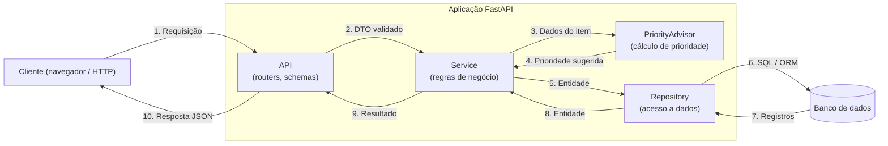

# Diagrama de componentes e fluxo de dados

```mermaid
flowchart LR
    Client["Cliente (navegador / HTTP)"]

    subgraph FastAPI["Aplicação FastAPI"]
        API["API<br/>(routers, schemas)"]
        Service["Service<br/>(regras de negócio)"]
        Advisor["PriorityAdvisor<br/>(cálculo de prioridade)"]
        Repo["Repository<br/>(acesso a dados)"]
    end

    DB[("Banco de dados")]

    Client -- "1. Requisição" --> API
    API -- "2. DTO validado" --> Service
    Service -- "3. Dados do item" --> Advisor
    Advisor -- "4. Prioridade sugerida" --> Service
    Service -- "5. Entidade" --> Repo
    Repo -- "6. SQL / ORM" --> DB
    DB -- "7. Registros" --> Repo
    Repo -- "8. Entidade" --> Service
    Service -- "9. Resultado" --> API
    API -- "10. Resposta JSON" --> Client
```
